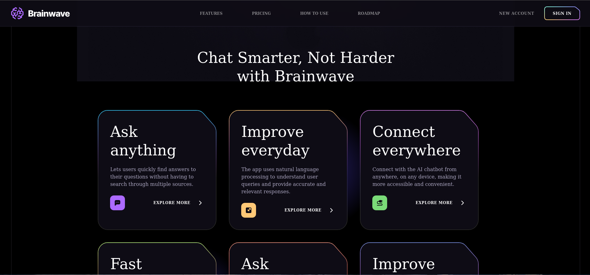
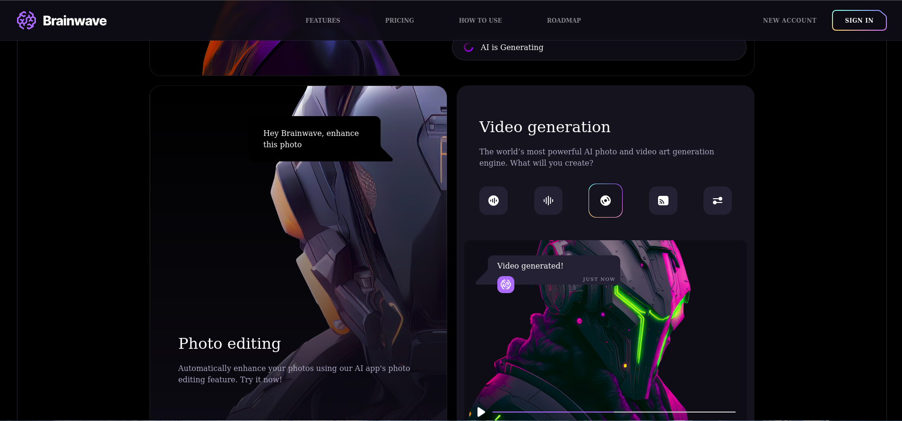
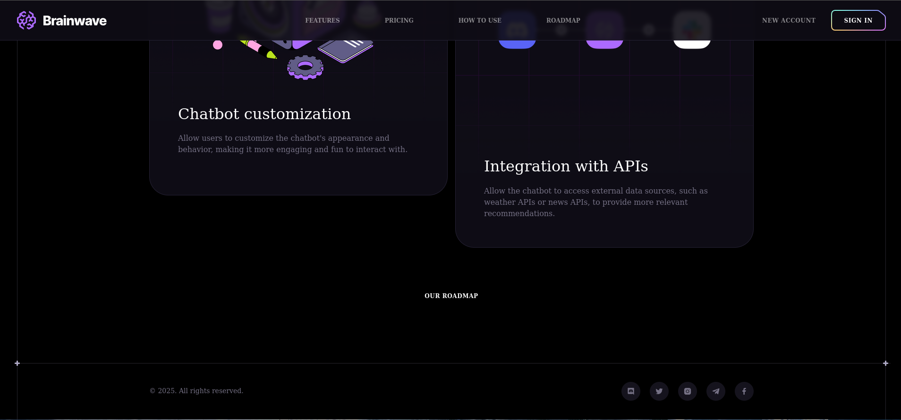

# 🚀 Project Name

A modern web application built with **React** and **Tailwind CSS**, deployed seamlessly on [Vercel](https://vercel.com).

## 🌐 Live Demo
🔗 [View Project](https://brain-wave12.vercel.app/)

---

## 📌 Features
- ⚡ Fast and responsive UI with TailwindCSS  
- 📱 Mobile-first design  
- 🎨 Clean and modern user interface  
- 🚀 Deployed on Vercel with CI/CD integration  

---

## 🛠️ Tech Stack
- **Frontend:** React, Tailwind CSS  
- **Deployment:** Vercel  

---

## 📂 Project Setup

### 1️⃣ Clone the repository
```bash
git clone https://github.com/Haji-Sharifi/BrainWave.git
cd  BrainWave
```

### 2️⃣ Install dependencies
```bash
npm install
```

### 3️⃣ Start development server
```bash
npm start
  ||
npm run dev
```

The app will be running at `http://localhost:3000`.

---

## 🚀 Deployment on Vercel
Every push to the `main` branch will automatically trigger a new deployment on Vercel.  
You can also manually deploy using:
```bash
vercel --prod
```

---

## 📸 Screenshots






---
